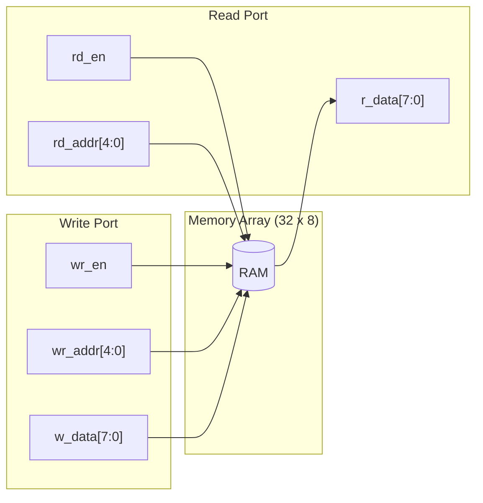
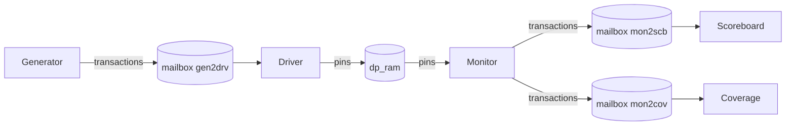

# Dual-Port RAM (1R/1W) — SystemVerilog + UVM-lite Testbench

A compact **dual‑port RAM** (single write port + single read port) in SystemVerilog with a lightweight class-based testbench (generator/driver/monitor/scoreboard/coverage).

> **Read-during-write policy:** *READ_FIRST* — when `wr_en` and `rd_en` are high on the same cycle and `wr_addr == rd_addr`, the read port returns the **old** data while the write updates memory for the next cycle.

---

## 📦 Repository Structure

```
├─ dp_ram_design.sv     # DUT: dual-port RAM (1R/1W)
├─ intf.sv              # Virtual interface for TB <-> DUT
├─ transaction.sv       # Randomizable transaction item
├─ generator.sv         # Stimulus sequences (write/read combos)
├─ driver.sv            # Drives interface from transactions
├─ monitor.sv           # Samples pins into transactions
├─ scoreboard.sv        # Golden model + checking
├─ cov.sv               # Functional coverage (addr/data bins)
├─ env.sv               # Testbench environment wiring
└─ testbench.sv         # Top module that instantiates DUT+TB
```

---

## 🧩 DUT Overview

**Module:** `dp_ram`

### Ports
| Name     | Dir / Type              | Description                           |
|----------|-------------------------|---------------------------------------|
| `clk`    | input                   | Clock                                  |
| `rst`    | input                   | Synchronous, active‑high reset         |
| `wr_en`  | input bit               | Write enable                           |
| `rd_en`  | input bit               | Read enable                            |
| `wr_addr`| input logic [4:0]       | Write address (depth = 32)             |
| `rd_addr`| input logic [4:0]       | Read address (depth = 32)              |
| `w_data` | input logic [7:0]       | Write data                             |
| `r_data` | output reg  [7:0]       | Registered read data                   |

> Note: Comments in the design indicate a 20‑bit address plan; this instance uses **5‑bit** addresses (32x8) for quick simulation. You can scale widths as needed.

### Block Diagram (DUT)



**Read/Write semantics:**

- **WRITE** (`wr_en=1`): `mem[wr_addr] <= w_data` on the rising edge.
- **READ**  (`rd_en=1`): `r_data <= mem[rd_addr]` sampled on the rising edge.
- **Same‑cycle R+W, same address:** **READ_FIRST** → `r_data` sees **old** contents; the write becomes visible next cycle.

---

## 🧪 Testbench Architecture

The testbench is a simple SV Verification setup using mailboxes and a virtual interface.



**Components**
- **`transaction.sv`**: randomizable `{{wr_addr, rd_addr, w_data}}` with control flags `{{wr_en, rd_en}}`.
- **`generator.sv`**: tasks for `write`, `read`, `write_read_same_addr()` and other mixes.
- **`driver.sv`**: consumes transactions from `gen2drv` and drives the interface.
- **`monitor.sv`**: observes DUT pins each cycle and publishes to the scoreboard and coverage.
- **`scoreboard.sv`**: maintains a reference model (array) and checks read data against expected values using **READ_FIRST** ordering (read before write on same cycle/address).
- **`cov.sv`**: address/data coverage. (Update bins to match current address width; right now the address bins show 20‑bit ranges.)

> Tip: Type your mailboxes as `mailbox #(transaction)` to avoid VCP2947 warnings and get better type checking.

---

## ✅ Known Items / TODO

- **Address width mismatch in coverage:** `cov.sv` uses 20‑bit bins while DUT uses 5‑bit addresses. Adjust bins to `[0:31]`.
- **Driver/Monitor loops:** Ensure `driver.run()` and `monitor.run()` loop on clock and process multiple transactions.
- **Mailbox typing:** Replace untyped `mailbox` with `mailbox#(transaction)` in all components to eliminate VCP2947 warnings.
- **Parameterization:** Consider parameters for `ADDR_W` and `DATA_W` in `dp_ram` and the interface to scale the depth and data width cleanly.

---
